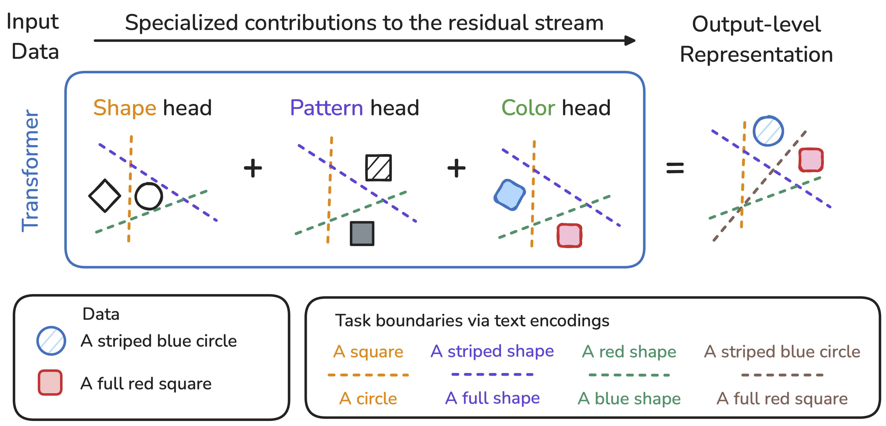

# ResiDual Transformer Alignment with Spectral Decomposition

[OpenReview](https://openreview.net/forum?id=z37LCgSIzI) |
[arXiv](https://arxiv.org/abs/2411.00246) |
[BibTeX](#-citation)

<p align="center">
    
</p>

[Lorenzo Basile](https://scholar.google.com/citations?user=EUE33IQAAAAJ)\*,
[Valentino Maiorca](https://vale.maiorca.xyz/)\*,
[Luca Bortolussi](https://scholar.google.com/citations?user=p5ynADcAAAAJ)\*,
[Emanuele Rodolà](https://gladia.di.uniroma1.it/authors/rodola/)
[Francesco Locatello](https://www.francescolocatello.com/),

\* *equal contribution*

---
[](https://github.com/grok-ai/py-template)
[](https://github.com/astral-sh/ruff)
[](https://github.com/astral-sh/uv)


## 📦 Installation

You can add this repository directly as a dependency using:

```
git+https://github.com/Flegyas/ResiDual.git
```

This means you can install it using **either**:

**[`uv`](https://github.com/astral-sh/uv) (recommended):**
```bash
uv pip install git+https://github.com/Flegyas/ResiDual.git
```

**Regular `pip`:**
```bash
pip install git+https://github.com/Flegyas/ResiDual.git
```

> If you use SSH for GitHub access, use:
> ```
> git+ssh://git@github.com/Flegyas/ResiDual.git
> ```

---

## Development installation

Setup the development environment:

```bash
git clone git@github.com:Flegyas/ResiDual.git
cd ResiDual
uv sync
source .venv/bin/activate
pre-commit install
```

### 🧪 Paper Experiments

All experiments from the paper (main text, appendix and extra ones from the rebuttal) are included in this repository and are fully reproducible. Each experiment is organized as a self-contained unit consisting of:

- **A configuration file** (`.gin`) using [gin-config](https://github.com/google/gin-config) to define hyperparameters and modular settings.
- **A script** that loads the configuration and runs the full experiment pipeline (e.g., training, evaluation, saving results).
- **A Jupyter notebook** to analyze, aggregate and export the results.

This structure ensures reproducibility and transparency of all results presented in the paper.

To rerun or modify an experiment, we advise following the same order: i) when possible, simply adjust the configuration file; ii) otherwise, tweak the main script; iii) update the notebooks only if the output structure or analysis changes.

### 📄 Citation

If you use this work in your research, please cite:

> **ResiDual Transformer Alignment with Spectral Decomposition**
> Lorenzo Basile, Valentino Maiorca, Luca Bortolussi, Emanuele Rodolà, Francesco Locatello
> *Transactions on Machine Learning Research (TMLR), 2025*
> [https://openreview.net/forum?id=z37LCgSIzI](https://openreview.net/forum?id=z37LCgSIzI)

**BibTeX**:
```bibtex
@article{basile2025residual,
  title     = {ResiDual Transformer Alignment with Spectral Decomposition},
  author    = {Lorenzo Basile and Valentino Maiorca and Luca Bortolussi and Emanuele Rodolà and Francesco Locatello},
  journal   = {Transactions on Machine Learning Research},
  year      = {2025},
  url       = {https://openreview.net/forum?id=z37LCgSIzI},
  note      = {}
}
